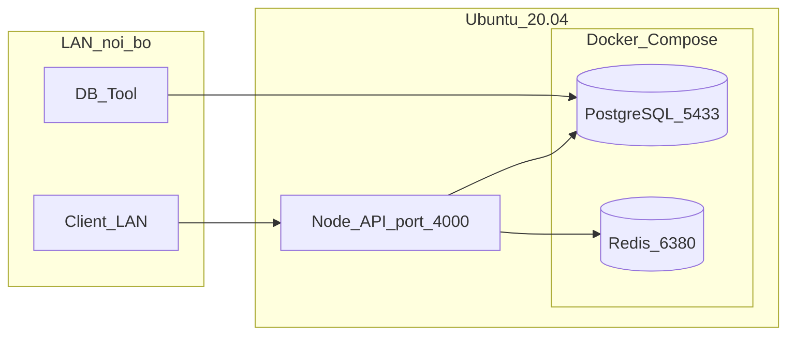

# Deploy AI Orchestrator — Internal Server (Ubuntu 20.04)

Runbook self-service để triển khai **ai-orchestrator** trên server nội bộ.

**Mô hình triển khai (hybrid):**

| Thành phần | Cách chạy | Port | Truy cập |
|---|---|---|---|
| PostgreSQL | Docker Compose | 5433 | LAN nội bộ |
| Redis | Docker Compose | 6380 (localhost only) | Chỉ app trên host |
| Node.js API | systemd trên host | 4000 | LAN nội bộ |



---

## 0. Yêu cầu

- Ubuntu 20.04 LTS
- Quyền `sudo`
- Git, Docker, Docker Compose v2
- Node.js 18.x hoặc 22.x LTS
- pnpm 10.x+
- Server có IP LAN cố định (ví dụ `192.168.1.100`)

---

## 1. Setup lần đầu

### 1.1 Cài dependencies hệ thống

```bash
sudo apt update && sudo apt upgrade -y
sudo apt install -y git curl build-essential ufw

# Docker (official)
curl -fsSL https://get.docker.com | sudo sh
sudo usermod -aG docker $USER
# Logout/login lại để group docker có hiệu lực

# Node.js 22 LTS (via nvm — khuyến nghị)
curl -o- https://raw.githubusercontent.com/nvm-sh/nvm/v0.40.1/install.sh | bash
source ~/.bashrc
nvm install 22
nvm use 22

# pnpm
corepack enable
corepack prepare pnpm@10.23.0 --activate
```

### 1.2 Tạo user deploy và clone repo

```bash
sudo useradd -m -s /bin/bash deploy || true
sudo usermod -aG docker deploy

sudo mkdir -p /opt/ai-orchestrator
sudo chown deploy:deploy /opt/ai-orchestrator

sudo -u deploy git clone <REPO_URL> /opt/ai-orchestrator
cd /opt/ai-orchestrator
```

### 1.3 Cấu hình `.env`

```bash
sudo -u deploy cp .env.example .env
sudo -u deploy nano .env
```

**Giá trị bắt buộc cho internal server:**

```env
PORT=4000
NODE_ENV=production

# App chạy trên host → kết nối DB/Redis qua localhost
POSTGRES_HOST=localhost
POSTGRES_PORT=5433
REDIS_HOST=localhost
REDIS_PORT=6380

# ĐỔI password mạnh trước khi mở LAN
POSTGRES_USER=postgres
POSTGRES_PASSWORD=<strong-password>
POSTGRES_DB=ai_orchestrator

AI_GATEWAY_URL=https://api.openai.com/v1
AI_API_KEY=<your-api-key>
```

### 1.4 Khởi động infra (PostgreSQL + Redis)

```bash
cd /opt/ai-orchestrator
docker compose up -d
docker compose ps
```

Kiểm tra:

```bash
docker compose exec postgres pg_isready -U postgres
docker compose exec redis redis-cli ping
# PONG
```

> **Dev only:** Redis Commander UI: `docker compose --profile dev up -d redis-commander` → http://localhost:8081

### 1.5 Build app

```bash
cd /opt/ai-orchestrator
sudo -u deploy pnpm install --frozen-lockfile
sudo -u deploy pnpm run build
```

### 1.6 Cài systemd service

```bash
sudo cp deploy/systemd/ai-orchestrator.service /etc/systemd/system/
sudo systemctl daemon-reload
sudo systemctl enable ai-orchestrator
sudo systemctl start ai-orchestrator
sudo systemctl status ai-orchestrator
```

### 1.7 Firewall (UFW)

Thay `192.168.1.0/24` bằng subnet LAN thực tế của bạn.

```bash
sudo ufw default deny incoming
sudo ufw default allow outgoing
sudo ufw allow from 192.168.1.0/24 to any port 4000 proto tcp comment 'AI Orchestrator API'
sudo ufw allow from 192.168.1.0/24 to any port 5433 proto tcp comment 'PostgreSQL LAN'
sudo ufw allow OpenSSH
sudo ufw enable
sudo ufw status numbered
```

> Redis **không** mở ra LAN — bind `127.0.0.1:6380` trong docker-compose.

---

## 2. Verify sau deploy

```bash
# Trên server
curl http://127.0.0.1:4000/health

# Từ máy khác trong LAN (thay IP)
curl http://192.168.1.100:4000/health

# PostgreSQL từ LAN
psql "postgresql://postgres:<password>@192.168.1.100:5433/ai_orchestrator" -c "SELECT 1"
```

Kết quả mong đợi: HTTP 200 từ `/health`, `SELECT 1` trả về `1`.

---

## 3. Deploy routine (cập nhật code)

Dùng script có sẵn:

```bash
cd /opt/ai-orchestrator
sudo -u deploy bash deploy/scripts/deploy.sh
```

Hoặc thủ công:

```bash
cd /opt/ai-orchestrator
git pull --ff-only
pnpm install --frozen-lockfile
pnpm run build
sudo systemctl restart ai-orchestrator
curl http://127.0.0.1:4000/health
```

---

## 4. Vận hành hàng ngày

### Logs

```bash
sudo journalctl -u ai-orchestrator -f
sudo journalctl -u ai-orchestrator --since "1 hour ago"
```

### Restart / stop

```bash
sudo systemctl restart ai-orchestrator
sudo systemctl stop ai-orchestrator
sudo systemctl start ai-orchestrator
```

### Infra (Docker)

```bash
cd /opt/ai-orchestrator
docker compose ps
docker compose logs -f postgres
docker compose logs -f redis
docker compose restart postgres
```

### Backup PostgreSQL

```bash
cd /opt/ai-orchestrator
sudo -u deploy bash deploy/scripts/backup-postgres.sh
# Output: /var/backups/ai-orchestrator/ai_orchestrator_YYYYMMDD_HHMMSS.sql.gz
```

Cron hàng ngày (ví dụ 02:00):

```bash
sudo crontab -u deploy -e
# Thêm dòng:
0 2 * * * /opt/ai-orchestrator/deploy/scripts/backup-postgres.sh >> /var/log/ai-orchestrator-backup.log 2>&1
```

---

## 5. Troubleshooting

| Triệu chứng | Nguyên nhân thường gặp | Cách xử lý |
|---|---|---|
| `curl :4000` connection refused | Service chưa chạy hoặc sai PORT | `systemctl status ai-orchestrator`, kiểm tra `.env` PORT=4000 |
| App crash loop | DB chưa sẵn sàng / sai password | `docker compose ps`, test `pg_isready`, xem journalctl |
| LAN không vào được :4000 | UFW chặn | `sudo ufw status`, mở port 4000 cho subnet LAN |
| LAN không vào được :5433 | UFW hoặc firewall ngoài | Mở port 5433 cho subnet LAN |
| Redis connection error từ app | Sai host/port | `.env`: REDIS_HOST=localhost, REDIS_PORT=6380 |

**Debug nhanh:**

```bash
sudo systemctl status ai-orchestrator
sudo journalctl -u ai-orchestrator -n 50 --no-pager
docker compose ps
docker compose logs postgres --tail 30
ss -tlnp | grep -E '4000|5433|6380'
```

---

## 6. Rollback

### Rollback app (git)

```bash
cd /opt/ai-orchestrator
git log --oneline -5
git checkout <previous-commit-sha>
pnpm install --frozen-lockfile
pnpm run build
sudo systemctl restart ai-orchestrator
```

### Restore database

```bash
# Dừng app trước khi restore
sudo systemctl stop ai-orchestrator

gunzip -c /var/backups/ai-orchestrator/ai_orchestrator_YYYYMMDD_HHMMSS.sql.gz \
  | docker exec -i ai-orchestrator-postgres psql -U postgres -d ai_orchestrator

sudo systemctl start ai-orchestrator
```

---

## 7. Security checklist

- [ ] Đổi `POSTGRES_PASSWORD` mặc định trước khi mở LAN
- [ ] UFW chỉ mở port 4000, 5433 cho subnet LAN (không mở ra internet)
- [ ] Redis bind `127.0.0.1` — không expose ra LAN
- [ ] Không chạy `redis-commander` trên production (profile `dev` only)
- [ ] `.env` không commit lên git (`chmod 600 .env`)
- [ ] Backup PostgreSQL định kỳ
- [ ] Cập nhật OS và Docker image định kỳ

---

## 8. Port reference

| Service | Host port | Bind | Mục đích |
|---|---|---|---|
| API | 4000 | 0.0.0.0 (mặc định Node) | REST/SSE cho client LAN |
| PostgreSQL | 5433 | 0.0.0.0 (Docker) | DB client từ LAN |
| Redis | 6380 | 127.0.0.1 only | Cache/queue — app host only |
| Redis Commander | 8081 | dev profile only | Debug local |

---

## 9. File tham chiếu trong repo

| File | Mục đích |
|---|---|
| `docker-compose.yml` | PostgreSQL + Redis infra |
| `deploy/systemd/ai-orchestrator.service` | systemd unit |
| `deploy/scripts/deploy.sh` | Deploy routine |
| `deploy/scripts/backup-postgres.sh` | Backup DB |
| `.env.example` | Template biến môi trường |
