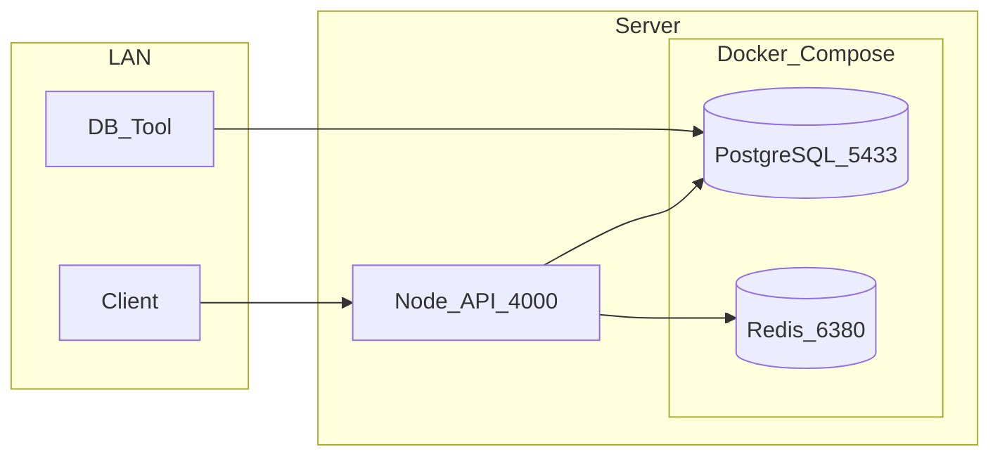

# Deploy AI Orchestrator — Internal Server (PoC)

Runbook đơn giản cho server nội bộ: **Docker Compose** chạy PostgreSQL + Redis, **Node.js app chạy bằng PM2** trên host.

| Thành phần | Cách chạy | Port |
|---|---|---|
| PostgreSQL | Docker Compose | 5433 (LAN) |
| Redis | Docker Compose | 6380 (localhost only) |
| Node.js API | PM2 (`pnpm --filter ai-orchestrator start:pm2`) | 4000 (LAN) |



---

## 1. Cài dependencies

```bash
sudo apt update && sudo apt upgrade -y
sudo apt install -y git curl build-essential

# Docker + Docker Compose v2
curl -fsSL https://get.docker.com | sudo sh
sudo usermod -aG docker $USER
# Logout/login lại để group docker có hiệu lực

# Node.js 22 LTS (nvm)
curl -o- https://raw.githubusercontent.com/nvm-sh/nvm/v0.40.1/install.sh | bash
source ~/.bashrc
nvm install 22
nvm use 22

# pnpm
corepack enable
corepack prepare pnpm@10.23.0 --activate

# PM2 (process manager)
npm install -g pm2
```

Kiểm tra:

```bash
docker compose -f infra/docker-compose.yml version
node -v
pnpm -v
pm2 -v
```

---

## 2. Clone repo

### HTTPS + Fine-grained PAT (khuyến nghị)

```bash
git config --global credential.helper store

git clone https://github.com/sonbkt303/ai-orchestrator.git
cd ai-orchestrator
```

Nhập **một lần** khi được hỏi:
- Username: GitHub username
- Password: PAT (không phải password GitHub)

```bash
chmod 600 ~/.git-credentials
```

---

## 3. Cấu hình `.env`

```bash
cp .env.example .env
nano .env
```

Giá trị tối thiểu:

```env
PORT=4000
NODE_ENV=production

POSTGRES_HOST=localhost
POSTGRES_PORT=5433
REDIS_HOST=localhost
REDIS_PORT=6380

POSTGRES_USER=postgres
POSTGRES_PASSWORD=<strong-password>
POSTGRES_DB=ai_orchestrator

AI_GATEWAY_URL=https://api.openai.com/v1
AI_API_KEY=<your-api-key>
```

---

## 4. Khởi động infra

```bash
docker compose -f infra/docker-compose.yml up -d
docker compose -f infra/docker-compose.yml ps
```

Kiểm tra:

```bash
docker compose -f infra/docker-compose.yml exec postgres pg_isready -U postgres
docker compose -f infra/docker-compose.yml exec redis redis-cli ping
# PONG
```

Hoặc dùng script:

```bash
pnpm infra:up
```

---

## 5. Build và chạy app (PM2)

```bash
pnpm install --frozen-lockfile
pnpm --filter ai-orchestrator build
pnpm --filter ai-orchestrator start:pm2
```

App lắng nghe tại **http://0.0.0.0:4000**. PM2 tự restart khi crash.

Kiểm tra trạng thái:

```bash
pm2 status
pm2 logs ai-orchestrator
curl http://127.0.0.1:4000/health
```

### PM2 — lệnh thường dùng

| Hành động | Lệnh |
|---|---|
| Start | `pnpm --filter ai-orchestrator start:pm2` hoặc `pm2 start ecosystem.config.cjs` |
| Stop | `pnpm --filter ai-orchestrator stop:pm2` hoặc `pm2 stop ai-orchestrator` |
| Restart | `pnpm --filter ai-orchestrator restart:pm2` hoặc `pm2 restart ai-orchestrator` |
| Logs | `pnpm --filter ai-orchestrator logs:pm2` hoặc `pm2 logs ai-orchestrator` |
| Xóa khỏi PM2 | `pm2 delete ai-orchestrator` |

### Tự chạy lại sau reboot server (tuỳ chọn)

```bash
pm2 startup
# Chạy lệnh sudo mà PM2 in ra (copy/paste)
pm2 save
```

---

## 6. Verify

```bash
# Trên server
curl http://127.0.0.1:4000/health

# Từ máy khác trong LAN (thay IP server)
curl http://<SERVER_IP>:4000/health

# PostgreSQL từ LAN
psql "postgresql://postgres:<password>@<SERVER_IP>:5433/ai_orchestrator" -c "SELECT 1"
```

---

## 7. Cập nhật code

```bash
cd ai-orchestrator
git pull --ff-only
pnpm install --frozen-lockfile
pnpm --filter ai-orchestrator build
pnpm --filter ai-orchestrator restart:pm2
curl http://127.0.0.1:4000/health
```

---

## 8. Vận hành

### Infra (Docker)

```bash
docker compose -f infra/docker-compose.yml ps
docker compose -f infra/docker-compose.yml logs -f postgres
docker compose -f infra/docker-compose.yml logs -f redis
docker compose -f infra/docker-compose.yml down          # dừng
docker compose -f infra/docker-compose.yml up -d         # bật lại
pnpm infra:down          # hoặc dùng script
pnpm infra:reset         # dừng + xóa volumes
```

### App (PM2)

| Hành động | Lệnh |
|---|---|
| Start | `pnpm --filter ai-orchestrator start:pm2` |
| Restart | `pnpm --filter ai-orchestrator restart:pm2` |
| Stop | `pnpm --filter ai-orchestrator stop:pm2` |
| Logs | `pnpm --filter ai-orchestrator logs:pm2` |
| Dev local (hot reload) | `pnpm --filter ai-orchestrator dev` |
| Build | `pnpm --filter ai-orchestrator build` |

---

## 9. Troubleshooting

| Triệu chứng | Cách xử lý |
|---|---|
| `pnpm: command not found` | `source ~/.bashrc`, kiểm tra `nvm use 22` |
| `pm2: command not found` | `npm install -g pm2` (cùng Node version với nvm) |
| PM2 start fail | Chưa build | `pnpm --filter ai-orchestrator build` rồi `pnpm --filter ai-orchestrator start:pm2` |
| `permission denied` khi docker | Logout/login sau `usermod -aG docker` |
| App không kết nối DB | Kiểm tra `docker compose -f infra/docker-compose.yml ps`, `.env` POSTGRES_* |
| Redis error | `.env`: `REDIS_HOST=localhost`, `REDIS_PORT=6380` |
| LAN không vào :4000 / :5433 | Kiểm tra firewall server, mở port nếu cần |

```bash
docker compose -f infra/docker-compose.yml ps
docker compose -f infra/docker-compose.yml logs postgres --tail 30
ss -tlnp | grep -E '4000|5433|6380'
```

---

## 10. Port reference

| Service | Port | Ghi chú |
|---|---|---|
| API | 4000 | App Node.js |
| PostgreSQL | 5433 | Expose LAN (docker-compose) |
| Redis | 6380 | Chỉ localhost (`127.0.0.1`) |
