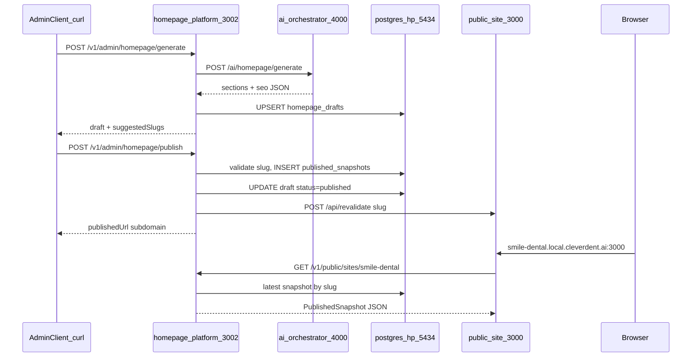

# Handoff — Clever Dent AI Monorepo (Implementation Context)

| Trường | Giá trị |
|--------|---------|
| Ngày cập nhật | 2026-07-02 |
| Phạm vi | Deploy internal server + Auto-gen Homepage + Publish Subdomain |
| Trạng thái | **Local E2E hoàn thành** — sẵn sàng cho phase tiếp theo |
| Đối tượng đọc | Dev/DevOps tiếp quản implement admin UI, prod deploy, F5 booking |

> File này tổng hợp **quyết định đã chốt** và **trạng thái code hiện tại** để session/agent mới có thể implement tiếp mà không cần đọc lại toàn bộ chat history.

---

## 1. Tóm tắt nhanh

Monorepo **Clever Dent AI** gồm 3 app + 2 shared packages:

| App / Package | Port | Vai trò |
|---------------|------|---------|
| `apps/public-site` | 3000 | F4 — trang homepage bệnh nhân (Next.js) |
| `apps/homepage-platform` | 3002 | F2/F3 — CMS API, draft, publish, slug registry |
| `apps/ai-orchestrator` | 4000 | F6 — AI gateway (chat + homepage generate) |
| `packages/shared-contracts` | — | Zod schemas dùng chung |
| `packages/shared-utils` | — | Slug validate/suggest, reserved slugs |

**Luồng đã implement (local):**

```
Admin/curl → generate draft → publish snapshot → public-site serve qua subdomain/path
```

**Chiến lược triển khai:** `local_first` — hoàn thiện local trước, production subdomain (`*.cleverdent.ai`) là phase sau.

---

## 2. Final Making Decisions

### 2.1 Deploy internal server (PoC)

| # | Quyết định | Ghi chú |
|---|------------|---------|
| D1 | **Mạng:** LAN nội bộ only — không expose internet | UFW chỉ mở port cần thiết |
| D2 | **Kiến trúc hybrid:** Infra Docker Compose; **app Node không containerize** | Postgres + Redis trong Docker; app chạy host |
| D3 | **OS:** Ubuntu 20.04 LTS | PoC internal |
| D4 | **Process manager:** PM2 (PoC hiện tại) | Ban đầu plan systemd; runbook hiện dùng PM2 |
| D5 | **Port map:** AI `:4000`, HP `:5434`, AI DB `:5433`, Redis `:6380` (localhost only) | Redis bind `127.0.0.1` |
| D6 | **Redis Commander:** Chỉ profile `dev` — không chạy trên server prod | `docker compose --profile dev` |
| D7 | **Migration trên server:** **Không** chạy trong deploy routine PoC | Chỉ dev local: `pnpm db:migrate:ai/hp` |
| D8 | **Deploy flow:** `git pull → pnpm install → pnpm build → restart PM2 → health check` | Không Dockerfile, không containerize app |
| D9 | **Runbook:** Self-service markdown tại [`deploy-internal-server.md`](./deploy-internal-server.md) | DevOps tự chạy, không cần hỏi lại |
| D10 | **Không làm (PoC):** Dockerfile app, pgAdmin, auto-migrate prod | Có thể bổ sung sau |

### 2.2 Auto-gen Homepage + Publish Subdomain

| # | Quyết định | Ghi chú |
|---|------------|---------|
| H1 | **Domain model:** Subdomain theo slug | `{slug}.local.cleverdent.ai` (dev), `{slug}.cleverdent.ai` (prod sau) |
| H2 | **Custom domain riêng:** **Không** trong scope hiện tại | Phase sau nếu cần |
| H3 | **Write-path:** Generate → Draft → Publish → Snapshot → Public read | Tách rõ draft vs published |
| H4 | **AI generate:** Structured JSON (không stream) | `response_format: json_object` + Zod + retry 1 lần |
| H5 | **AI endpoint:** `POST /ai/homepage/generate` trong ai-orchestrator | Trả `sections` + `seo` only |
| H6 | **Orchestration:** homepage-platform gọi AI, lưu draft, expose admin API | PoC: **chưa auth** |
| H7 | **Slug conflict:** HTTP 409 `SLUG_CONFLICT` + `suggestedSlugs[]` | Dùng `shared-utils` |
| H8 | **Slug ownership:** Clinic hiện tại được giữ slug của mình khi regenerate | `getTakenSlugsExceptClinic` |
| H9 | **Published URL formula:** `{protocol}://{slug}.{PUBLIC_BASE_DOMAIN}[:port nếu dev]` | Helper `buildPublishedUrl()` |
| H10 | **Snapshot versioning:** Mỗi publish **INSERT** row mới vào `published_snapshots` | Giữ history |
| H11 | **Cache:** Sau publish gọi `POST /api/revalidate` với tag `site:{slug}` | Fail chỉ log warn, không block publish |
| H12 | **Public read:** `GET /v1/public/sites/:slug` đọc DB; mock fallback chỉ dev + slug `smile-dental` | |
| H13 | **Subdomain routing:** Next.js middleware rewrite `{subdomain}.{domain}` → `/{subdomain}` | Path-based `localhost:3000/{slug}` song song |
| H14 | **Hosts file local:** Wildcard DNS không khả thi — **mỗi slug mới thêm 1 dòng hosts** | Hoặc dùng path-based |
| H15 | **Draft lưu `clinicProfile`:** Bắt buộc để publish snapshot đủ dữ liệu clinic | Optional trong schema, required khi publish |
| H16 | **Reviews section:** Placeholder cố định (`placeholder: true`) | Khớp discovery decision #7 |
| H17 | **Locale AI copy:** Theo `clinicProfile.locale` | Prompt dùng locale clinic |

### 2.3 Codebase / scaffold decisions

| # | Quyết định | Ghi chú |
|---|------------|---------|
| C1 | **Giữ** `packages/shared-utils` | Dùng cho slug API + middleware reserved slugs |
| C2 | **Giữ** `packages/shared-contracts/src/booking.schema.ts` | Scaffold F5 — chưa implement booking flow |
| C3 | **Giữ** mock fixtures (`mock-snapshot.ts/json`) | Fallback dev khi API/DB chưa sẵn sàng |
| C4 | **Xóa** `playground/index.html` cũ | App dùng `src/frontend/` tại `/chat` |
| C5 | **Thêm `zod` trực tiếp** vào `ai-orchestrator` và `homepage-platform` | Vì dùng Zod parse trực tiếp, không chỉ qua shared-contracts |

### 2.4 Product discovery (chưa confirm khách hàng)

Các quyết định nghiệp vụ chi tiết nằm tại [`requirements-analysis/clever-dent-ai/01-discovery-decisions.md`](../requirements-analysis/clever-dent-ai/01-discovery-decisions.md) — trạng thái **Proposed**.

Implement hiện tại **không block** trên confirm khách hàng, nhưng các feature sau phải align:

- F1 sync một chiều CD → Homepage
- F5 booking form + Requested workflow
- F6 AI scheduling suggest (khác homepage generate)
- Footer legal template platform
- Google Maps fallback

---

## 3. Kiến trúc đã triển khai



---

## 4. Trạng thái implement

### ✅ Đã xong (local E2E)

| Hạng mục | Files chính |
|----------|-------------|
| Generate schema | `packages/shared-contracts/src/generate.schema.ts` |
| DB migration drafts | `apps/homepage-platform/src/db/migrations/002_homepage_drafts.sql` |
| AI homepage generate | `apps/ai-orchestrator/src/routes/homepage.routes.ts`, `services/homepage-generator.service.ts`, `prompts/homepage-generate.prompt.ts` |
| Gateway JSON mode | `apps/ai-orchestrator/src/services/gateway.service.ts` (`jsonMode`) |
| Draft CRUD + generate orchestration | `apps/homepage-platform/src/modules/homepage/homepage.service.ts` |
| Repositories | `draft.repository.ts`, `slug.repository.ts`, `snapshot.repository.ts` |
| Admin routes | `apps/homepage-platform/src/routes/admin.routes.ts` |
| Publish service | `apps/homepage-platform/src/modules/publish/publish.service.ts` |
| Public route DB | `apps/homepage-platform/src/routes/public.routes.ts` |
| Subdomain middleware | `apps/public-site/middleware.ts` |
| Revalidate API | `apps/public-site/app/api/revalidate/route.ts` |
| Env + URL builder | `apps/homepage-platform/src/config/index.ts` (`buildPublishedUrl`) |
| Local dev docs + fixture | `docs/local-development.md`, `fixtures/clinic-input.json` |
| Deploy runbook | `docs/deploy-internal-server.md` |
| Build pass | `pnpm build` toàn monorepo |

### ⏳ Chưa làm / phase tiếp theo

| Hạng mục | Priority | Ghi chú |
|----------|----------|---------|
| Admin UI (CMS) | P1 | Hiện test bằng curl/Postman |
| Admin auth (JWT/API key) | P1 | PoC không có auth |
| Clever Dent Core sync (F1) | P0 prod | Hiện input clinic qua JSON fixture |
| Booking form + API (F5) | P1 | `booking.schema.ts` đã có, chưa wire |
| Production subdomain `*.cleverdent.ai` | P2 | Wildcard DNS + TLS — xem §7 |
| Custom domain per clinic | P2 | Out of scope hiện tại |
| Deploy homepage-platform + public-site lên internal server | P1 | Runbook hiện chỉ cover ai-orchestrator |
| Integration test tự động | P2 | Hiện manual curl E2E |
| Image upload (hero, doctor photo) | P2 | Schema có `photoUrl`/`imageUrl`, chưa storage |
| i18n multi-language homepage | P2 | MVP một locale/clinic |
| Google Reviews thật | P2 | Placeholder only |
| Redis queue / cache | P3 | Infra sẵn, chưa dùng |

---

## 5. API Reference (đã implement)

### 5.1 Admin — homepage-platform `:3002`

| Method | Path | Body / Query | Response |
|--------|------|--------------|----------|
| POST | `/v1/admin/homepage/generate` | `GenerateHomepageRequest` JSON | `{ draft, suggestedSlugs? }` |
| GET | `/v1/admin/homepage/:clinicId/draft` | — | `{ draft }` |
| PATCH | `/v1/admin/homepage/:clinicId/draft` | Partial draft fields | `{ draft }` |
| GET | `/v1/admin/slugs/suggest` | `?name=&district=&city=` | `{ suggestedSlugs }` |
| POST | `/v1/admin/homepage/publish` | `{ "slug": "smile-dental" }` | `{ publishedUrl, publishedAt }` |

**Error codes đặc biệt:**

- `409 SLUG_CONFLICT` → `{ error, message, suggestedSlugs[] }`
- `400` Zod validation → `{ error, details }`
- `502` AI generation fail

### 5.2 AI — ai-orchestrator `:4000`

| Method | Path | Body | Response |
|--------|------|------|----------|
| POST | `/ai/homepage/generate` | `GenerateHomepageRequest` | `{ sections, seo }` |

### 5.3 Public — homepage-platform `:3002`

| Method | Path | Response |
|--------|------|----------|
| GET | `/v1/public/sites/:slug` | `PublishedSnapshot` hoặc 404 |

### 5.4 Public site — `:3000`

| Method | Path | Ghi chú |
|--------|------|---------|
| GET | `/{slug}` | Path-based access |
| GET | `{slug}.local.cleverdent.ai:3000` | Subdomain rewrite |
| POST | `/api/revalidate` | Header `x-revalidate-secret`, body `{ slug }` |

---

## 6. Database schema (homepage-platform)

**Migration files:** `apps/homepage-platform/src/db/migrations/`

```sql
-- 001_init.sql
slug_registry (slug PK, clinic_id UNIQUE, created_at)
published_snapshots (id, clinic_id, slug FK, snapshot JSONB, published_at)
  INDEX (slug, published_at DESC)

-- 002_homepage_drafts.sql
homepage_drafts (clinic_id PK, slug, draft JSONB, updated_at)
  INDEX (slug)
```

**Quy ước:**

- `homepage_drafts`: 1 draft/clinic, status trong JSON (`draft` | `published`)
- `published_snapshots`: append-only history; public API lấy `ORDER BY published_at DESC LIMIT 1`
- `slug_registry`: map slug → clinic_id sau publish thành công

---

## 7. Environment variables

### homepage-platform

| Biến | Local | Prod (sau) |
|------|-------|------------|
| `PORT` | 3002 | 3002 |
| `POSTGRES_*` | localhost:5434 | TBD |
| `AI_ORCHESTRATOR_URL` | http://localhost:4000 | Internal URL |
| `PUBLIC_SITE_URL` | http://localhost:3000 | https://cleverdent.ai |
| `PUBLIC_BASE_DOMAIN` | local.cleverdent.ai | cleverdent.ai |
| `PUBLIC_SITE_PROTOCOL` | http | https |
| `PUBLIC_SITE_PORT` | 3000 | *(bỏ — không append port)* |
| `REVALIDATE_SECRET` | dev-secret | Secret mạnh |

### public-site

| Biến | Local | Prod (sau) |
|------|-------|------------|
| `HOMEPAGE_API_URL` | http://localhost:3002 | Internal HP API URL |
| `PUBLIC_BASE_DOMAIN` | local.cleverdent.ai | cleverdent.ai |
| `REVALIDATE_SECRET` | dev-secret | Khớp HP |

### ai-orchestrator

| Biến | Ghi chú |
|------|---------|
| `PORT` | **4000** — bắt buộc khớp cross-app |
| `AI_GATEWAY_URL`, `AI_API_KEY`, `AI_MODEL` | Cần key hợp lệ để test generate |

---

## 8. Verify E2E (copy-paste)

**Prerequisites:** `pnpm infra:up`, `pnpm db:migrate:hp`, `pnpm dev:all`, `AI_API_KEY` hợp lệ.

```bash
# 1. Generate
curl -X POST http://localhost:3002/v1/admin/homepage/generate \
  -H "Content-Type: application/json" \
  -d @apps/homepage-platform/src/fixtures/clinic-input.json

# 2. Publish
curl -X POST http://localhost:3002/v1/admin/homepage/publish \
  -H "Content-Type: application/json" \
  -d '{"slug":"smile-dental"}'

# 3. Public API
curl http://localhost:3002/v1/public/sites/smile-dental

# 4. Public site (path)
curl http://localhost:3000/smile-dental

# 5. Subdomain (cần hosts: 127.0.0.1 smile-dental.local.cleverdent.ai)
curl http://smile-dental.local.cleverdent.ai:3000
```

**Expected `publishedUrl` (dev):** `http://smile-dental.local.cleverdent.ai:3000`

---

## 9. Production subdomain (chưa implement — ghi chú cho sau)

| Hạng mục | Giải pháp đề xuất |
|----------|-------------------|
| DNS | Wildcard `*.cleverdent.ai` → IP public-site |
| TLS | Caddy/nginx + Let's Encrypt wildcard cert |
| Env | `PUBLIC_BASE_DOMAIN=cleverdent.ai`, `PUBLIC_SITE_PROTOCOL=https`, bỏ `PUBLIC_SITE_PORT` |
| Deploy | PM2/systemd cho public-site (:443/:3000) + homepage-platform |
| Firewall | 443 public; admin API internal only |
| Runbook | Tạo `docs/deploy-public-site.md` khi sẵn sàng |

---

## 10. Rủi ro đã biết & cách xử lý

| Rủi ro | Giảm thiểu hiện tại | Cần làm thêm |
|--------|---------------------|--------------|
| AI trả JSON invalid | Zod parse + retry 1 lần | Log raw response; alert nếu fail rate cao |
| Slug trùng | `slug_registry` + suggest | UI hiển thị suggestions |
| Cache stale | Revalidate sau publish | Retry revalidate; ISR fallback time |
| Gateway không hỗ trợ json_object | Extract từ markdown code block | Test với gateway thật sớm |
| PoC không auth | OK cho dev | JWT + clinic scope trước prod |
| Hosts file từng slug | Path-based fallback | Wildcard DNS local (dnsmasq) hoặc prod wildcard |
| Publish fail thiếu clinicProfile | Validate 422 | Generate luôn embed clinicProfile |

---

## 11. File map quan trọng

```
packages/shared-contracts/src/
  homepage.schema.ts      # HomepageDraft, PublishedSnapshot, Sections
  generate.schema.ts      # GenerateHomepageRequest/Response
  publish.schema.ts       # PublishRequest/Response, SlugConflict
  booking.schema.ts       # F5 scaffold — chưa dùng

packages/shared-utils/src/
  slug.ts                 # validateSlug, normalizeSlugInput, RESERVED_SLUGS
  suggest-slug.ts         # suggestSlugs()

apps/ai-orchestrator/src/
  routes/homepage.routes.ts
  services/homepage-generator.service.ts
  services/gateway.service.ts
  prompts/homepage-generate.prompt.ts

apps/homepage-platform/src/
  routes/admin.routes.ts
  routes/public.routes.ts
  modules/homepage/homepage.service.ts
  modules/publish/publish.service.ts
  db/repositories/{draft,slug,snapshot}.repository.ts
  db/migrations/{001_init,002_homepage_drafts}.sql
  fixtures/clinic-input.json

apps/public-site/
  middleware.ts             # subdomain rewrite
  app/api/revalidate/route.ts
  lib/api-client.ts         # fetch snapshot from HP API
```

---

## 12. Thứ tự implement đề xuất (phase tiếp)

1. **Admin auth** — bảo vệ `/v1/admin/*` trước khi deploy LAN rộng hơn
2. **Deploy HP + public-site** — mở rộng runbook internal cho 3 app
3. **Clever Dent sync (F1)** — thay fixture JSON bằng webhook/poll từ CD Core
4. **Admin CMS UI (F2)** — form generate, preview draft, publish button
5. **Booking form (F5)** — wire `booking.schema.ts`, POST requested appointment
6. **Prod subdomain** — wildcard DNS + TLS + env prod
7. **Automated E2E test** — generate → publish → assert HTML/JSON

---

## 13. Tài liệu liên quan

| File | Mục đích |
|------|----------|
| [local-development.md](./local-development.md) | Setup dev, E2E curl, troubleshooting |
| [deploy-internal-server.md](./deploy-internal-server.md) | Deploy ai-orchestrator PoC |
| [requirements-analysis/clever-dent-ai/README.md](../requirements-analysis/clever-dent-ai/README.md) | Feature map F1–F7 |
| [01-discovery-decisions.md](../requirements-analysis/clever-dent-ai/01-discovery-decisions.md) | 9 blocker nghiệp vụ (Proposed) |
| [02-api-contract.md](../requirements-analysis/clever-dent-ai/02-api-contract.md) | Contract đầy đủ (Draft) |
| [06-implementation-roadmap.md](../requirements-analysis/clever-dent-ai/06-implementation-roadmap.md) | Phase 0–4 roadmap |

---

## 14. Glossary

| Thuật ngữ | Ý nghĩa |
|-----------|---------|
| **Draft** | Homepage chưa/đang chỉnh sửa, lưu `homepage_drafts` |
| **Snapshot** | Bản publish immutable, lưu `published_snapshots` |
| **Slug** | Subdomain identifier, vd. `smile-dental` |
| **Write-path** | Generate → draft → publish |
| **Read-path** | Public site fetch snapshot → render |
| **local_first** | Hoàn thiện local dev trước prod subdomain |
