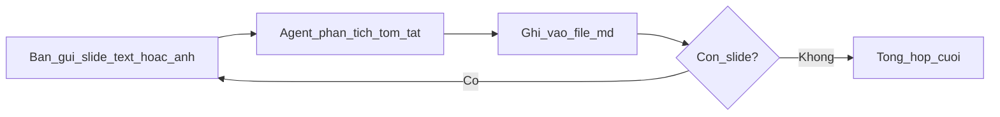

# Phân tích requirement từ slide PPTX tiếng Hàn

Thư mục này lưu kết quả **phân tích + tóm tắt requirement** (tiếng Việt) từ deck slide tiếng Hàn — không phải bản dịch word-by-word.

## Dự án đang phân tích

- [`clever-dent-ai.md`](clever-dent-ai.md) — file output chính (cập nhật tổng số slide khi biết)

## Bắt đầu dự án mới

1. Copy template:

   ```bash
   cp requirements-analysis/_template.md requirements-analysis/{ten-du-an}.md
   ```

2. Điền metadata ở đầu file (tên dự án, ngày, tổng số slide).

3. Trong chat Cursor, gửi từng slide — **một trong hai cách** (hoặc kết hợp):

   **Cách A — Text (copy từ PPTX):**

   ```
   Slide 3/25
   [Tiêu đề slide]

   [Nội dung text tiếng Hàn]
   ```

   **Cách B — Ảnh (screenshot slide):**

   ```
   Slide 3/25
   ```

   Đính kèm ảnh slide. Agent đọc ảnh, trích text Hàn và mô tả diagram/bảng.

   **Kết hợp:** paste text + đính kèm ảnh khi slide có diagram phức tạp.

4. Agent sẽ phân tích và append vào file dự án.

## Format mỗi slide

Mỗi slide gồm 3 phần:

| Phần | Mục đích |
|------|----------|
| **Ý chính** | Mục đích nghiệp vụ của slide |
| **Phân tích requirement** | Actor, hành vi, rule, luồng nghiệp vụ |
| **Điểm cần làm rõ** | Câu hỏi mở, thông tin thiếu |

Xem [`_template.md`](_template.md) để biết cấu trúc đầy đủ.

## Quy trình trong chat



### Tips khi gửi slide

- Luôn ghi số slide: `Slide 3/25`
- **Text:** copy đủ tiêu đề, bullet, bảng, ghi chú
- **Ảnh:** chụp full slide, chữ đủ rõ; diagram/flowchart nên dùng ảnh thay vì mô tả tay
- **Kết hợp:** text cho nội dung chữ + ảnh cho diagram/UI
- Slide title / thank you → ghi `Slide X: (bỏ qua)`

### Batch size khuyến nghị

- 1–3 slide/lần (mặc định)
- Slide phức tạp (flowchart, bảng lớn): 1 slide/lần
- Slide ngắn: tối đa 5 slide/lần

## Sau khi xong tất cả slide

Agent viết phần **Tổng hợp cuối** trong file dự án:

- Phạm vi hệ thống
- Actor / vai trò
- Chức năng chính
- Luồng nghiệp vụ
- Ràng buộc kỹ thuật
- Giả định & rủi ro
- Câu hỏi cần confirm

## Cursor skill & rule

- **Skill** [`.cursor/skills/korean-slide-requirements/SKILL.md`](../.cursor/skills/korean-slide-requirements/SKILL.md) — workflow đầy đủ, hỗ trợ input text hoặc ảnh
- **Rule** [`.cursor/rules/korean-slide-requirements.mdc`](../.cursor/rules/korean-slide-requirements.mdc) — output nhất quán khi làm việc với file trong thư mục này
